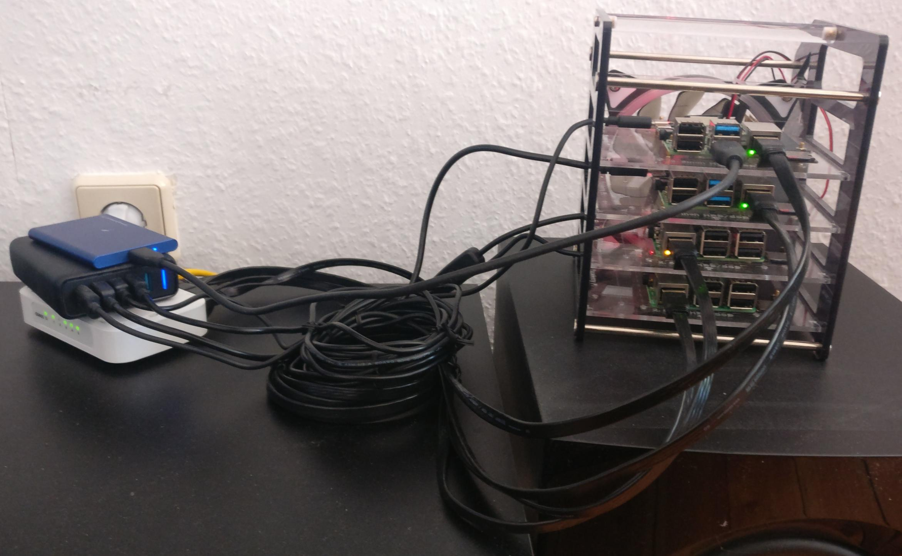

## Kubernetes@home

#### Using a bunch of Raspberry Pis and some ketchup

---



---

## Overview

1. Why?
2. How?
3. Demo (kinda, maybe)
4. Caveats
5. What next?

--

## But why?

<ul>
  <li>
    Kubernetes becomes ubiquitous
    <ul>
      <li>DevOps skills are in demand</li>
    </ul>
  </li>
  <li class="fragment">
    It's actually useful
    <ul>
      <li>Basically your private server farm</li>
      <li>Could host Minecraft, rocket.chat, PoCs, ...</li>
    </ul>
  </li>
  <li class="fragment">
    Because it's fun!
    <ul>
      <li>(Probably debatable)</li>
    </ul>
  </li>
  <li class="fragment">
    Because you can (duh)
    <ul>
      <li>It <span style="text-decoration: line-through">is</span> can be cheap</li>
      <li>It's easier than you might think</li>
    </ul>
  </li>
</ul>

Notes: It would be cheap if it weren't for the chip shortage.

---


----

## Hardware

* N RaspberryPis
  * N > 0
  * recommended: Raspberry Pi 4B 8GB, currently ~75€

Notes:
* You could take the 4GB variant as well.
* You can easily upgrade at any time.

----

## Software

* SSH to access the Pi(s)
* [k3sup](https://github.com/alexellis/k3sup) [ketchup]
* ([k3s](https://k3s.io/))

Notes: Pronounced 'ketchup'

----

## Software

(Assuming you can SSH onto your machines)

```bash
> SERVER=192.168.1.42
> AGENT=192.168.1.43
> k3sup install --ip $SERVER --user pi # setup server
> k3sup join --ip $AGENT --server-ip $SERVER --user pi # join agent
> kubectl --kubeconfig "$PWD/kubeconfig" get nodes
NAME                STATUS     ROLES                  AGE    VERSION
raspberrypirate     Ready      control-plane,master   1m     v1.20.6+k3s1
raspberrypinata     Ready      <none>                 1m     v1.20.6+k3s1
```

---

## Demo

There already is a [demo](https://github.com/alexellis/k3sup#demo-).

Notes: Ask if I should play the video.

---

## Caveats

<ul>
  <li class="fragment">
    ARM<span class="fragment">32</span>
    <ul>
      <li class="fragment">Almost always need to change to or even build a compatible image</li>
      <li class="fragment">Sometimes even that isn't possible</li>
    </ul>
  </li>
  <li class="fragment">
    Storage
    <ul>
      <li class="fragment">Always an issue with k8s</li>
      <li class="fragment">k3s-recommended distributed storage solution (Longhorn) doesn't support ARM32</li>
      <li class="fragment">Possible to hook up SSD drives and host NFS</li>
    </ul>
  </li>
</ul>

---

## What's next?

----

### Scaling

* Horizontally - more nodes
* Vertically - better nodes
* Both

----

### Automated Node Upgrades

* [well-documented and easy to setup](https://rancher.com/docs/k3s/latest/en/upgrades/automated/)
* can choose between [release channels](https://rancher.com/docs/k3s/latest/en/upgrades/basic/#release-channels)

----

### HA (High Availability)

* running control plane even if a server node crashes
* requires an odd number of server nodes (at least 3)
* [well-documented and easy to setup](https://rancher.com/docs/k3s/latest/en/installation/ha-embedded/)
* probably a bit much if you don't run anything crucial

---

## Resources

* [k3s](https://k3s.io/) and [documentation](https://rancher.com/docs/k3s/latest/en/)
* [k3sup](https://github.com/alexellis/k3sup)
* [Alex Ellis](https://blog.alexellis.io/), e.g. [Kubernetes Homelab with Raspberry Pi](https://blog.alexellis.io/raspberry-pi-homelab-with-k3sup/)
